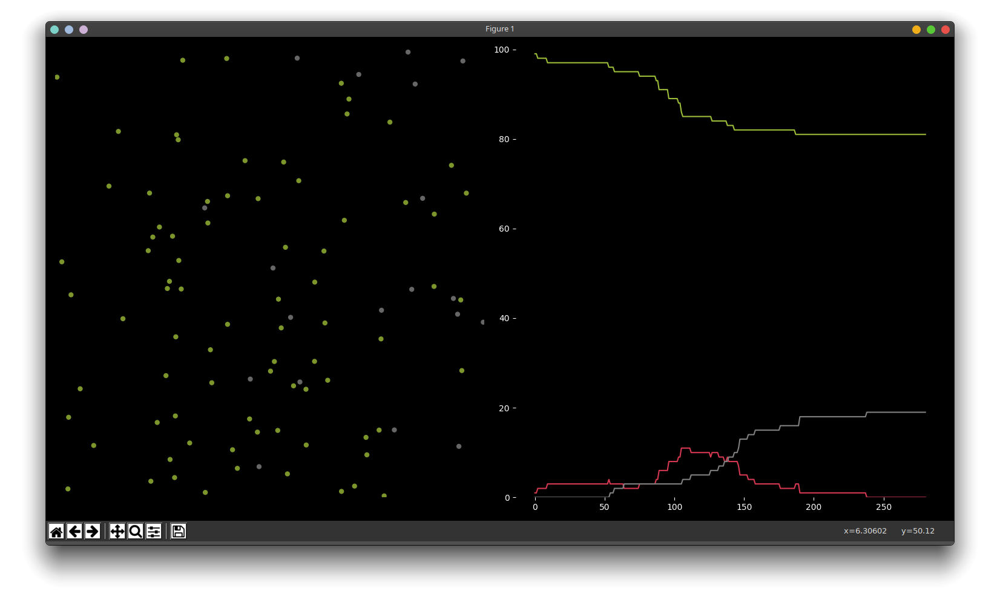

# Pokus o simulaci corony
1. Clone do složky
    
    ```git clone git@github.com:georges-circuits/covid_sim.git [název složky]```

2. Doporučuji založit virtuální prostředí
    
    [Tutoriál pro Linux/Mac](https://www.youtube.com/watch?v=Kg1Yvry_Ydk), [Tutoriál pro Windows](https://www.youtube.com/watch?v=APOPm01BVrk)

    ```python3 -m venv venv```

    ```source venv/bin/activate```

    Note: Poté už nemusíte psát ```pip3``` a ```python3```, venv používá nejnovější verzi automaticky.

3. Po aktivaci nainstalujte dependencies
    
    ```pip3 install -r requirements.txt ```

4. Spuštění
    
    Zatím jsou všechny parametry natvrdo v kódu, nejspíš to tak i zůstane, protože je to v tomto případě o **dost** jednodušší (jednak z důvodu množství parametrů a jednak kvůli samotnému charakteru aplikace - neustále se parametry přidávají a mění a vymyslet nějaký scalable systém, který by byl dostatečně flexibilní, je nad moji míru motivace)... Ale možná přidám komentáře jakmile se v tom sám ztratím.

    ```python3 sim.py```

# Worklog
Reminder: Česky!

### 1.4
Testování matplotlib a nástřel classy Person.

### 2.4
Matplot možná nebude nejlepší volbou pro takové kvantum dat... už s tou jednou rozbitou a špatně naprogramovanou tečkou to neběží tak rychle, jak by mělo a žere mi to 70% cpu. Teoreticky by šlo nechat simulaci běžet a zobrazovat jen třeba každý 100stav nebo nemít živý výstup vůbec.

Jde se vyzkoušet manim...

### 4.4
Fungují základní příklady ale nejede shader branch protože nemám grafiku.

Zpátky k matplotlib...
Funguje základní pohyb a respektování hranic.
Už mám i vizi výstupu.

Přidán requirements.txt

Barvičky a rozdělení na dva subploty

### 5.4
(Už je po půlnoci)
Dokončena implementace druhého grafu... chce to cleanup ale funguje to, celkově by bylo fajn dát tu celou spodní část do nějaké hezké classy ale zatím jsem nevymyslel jak. However mám možná vymyšlené jak kontrolovat blízkost lidí a šíření nákazy.

Z nějakého důvodu to běží napoprvé... Zatím je to hodně barebones ale základní princip funguje a už i tak to stihlo vyprodukovat celkem zajímavý průběh hned při prvním runu. Coded myself to sleep.


Ta class nebyla tak těžká, jen to chce cleanup, opět.

Cleanup a mnohem sofistikovanější zadávání údajů do grafu, možnost velice jednoduše rozšířit počet stavů - stačí připsat do slovníku COLORS. Komentáře aspoň v initu Simulace.

Opravdu je výsledek simulace vždycky naprosto rozdílný od předchozího. Tento průběh je spoštěný se stejným nastavením jako ten výš... Nevidím důvod proč by to nemělo být připravené na mnohem větší simulace, ale zatím mě baví sledovat tyto obrovské variace u těchto menších.



Opravena chyba v color map.

### 6.4
Snaha o implementaci relativního souřadnicového systému... Už se to dokonce samo zastaví jakmile už není nikdo nakažený. Možnost změny DAY konstanty, která určuje kolik updatů simulace se provede pro jeden update grafů.

Opuštění nápadu více států z důvodu komplexity a také si nejsem jistý jestli by mělo žádoucí přínos - sledování víceméně stejných průběhů na několika místech mi přijde jako plýtvání výpočetním výkonem. Tečky svojí velikostí symbolizují svůj infection_radius (snad).
