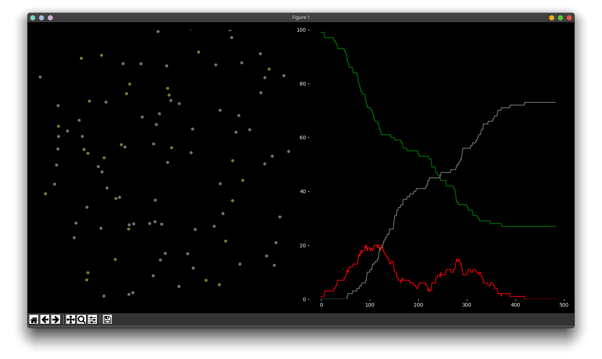

# Pokus o simulaci corony

# Worklog
Reminder: Česky!

### 1.4
Testování matplotlib a nástřel classy Person.

### 2.4
Matplot možná nebude nejlepší volbou pro takové kvantum dat... už s tou jednou rozbitou a špatně naprogramovanou tečkou to neběží tak rychle, jak by mělo a žere mi to 70% cpu. Teoreticky by šlo nechat simulaci běžet a zobrazovat jen třeba každý 100stav nebo nemít živý výstup vůbec.

Jde se vyzkoušet manim...

### 4.4
Fungují základní příklady ale nejede shader branch protože nemám grafiku.

Zpátky k matplotlib...
Funguje základní pohyb a respektování hranic.
Už mám i vizi výstupu.

Přidán requirements.txt

Barvičky a rozdělení na dva subploty

### 5.4
(Už je po půlnoci)
Dokončena implementace druhého grafu... chce to cleanup ale funguje to, celkově by bylo fajn dát tu celou spodní část do nějaké hezké classy ale zatím jsem nevymyslel jak. However mám možná vymyšlené jak kontrolovat blízkost lidí a šíření nákazy.

Z nějakého důvodu to běží napoprvé... Zatím je to hodně barebones ale základní princip funguje a už i tak to stihlo vyprodukovat celkem zajímavý průběh hned při prvním runu. Coded myself to sleep.

